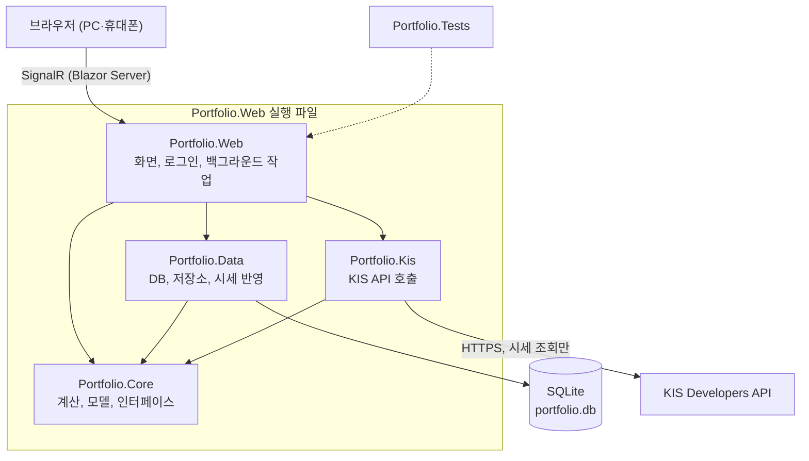
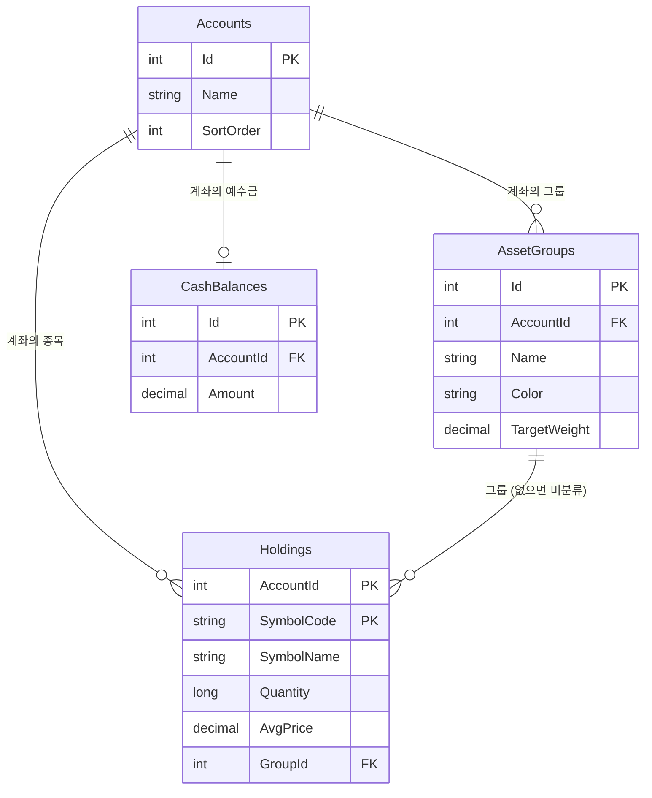
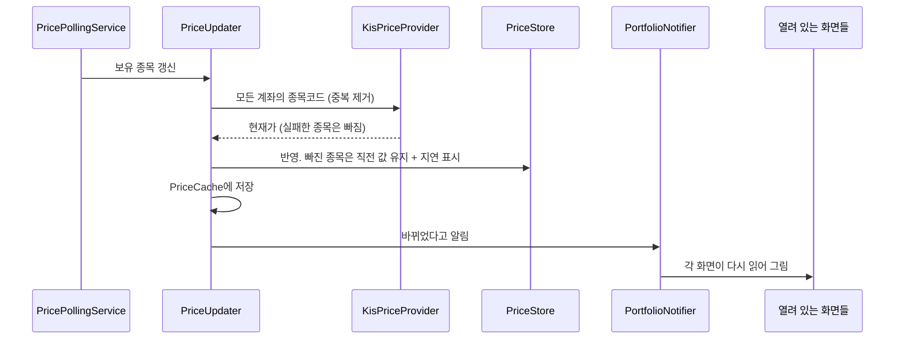

# 포트폴리오 대시보드 개발 리포트

작성일: 2026-10-07 · 기준: `main` (PR #14 병합 후, 커밋 55개)

이 문서는 지금까지 만든 것과 코드 구조를 한곳에 정리한 것이다. 요구사항과 계산 규칙의 원문은 [design.md](design.md), 설치와 사용 방법은 [operations.md](operations.md)에 있다.

## 1. 요약

삼성증권 보유 종목을 직접 입력하면, 한국투자증권(KIS) 시세로 평가금액·손익·비중을 계산하고 목표 비중에 맞춘 매수·매도 수량을 알려 주는 개인용 웹 앱이다.

- 설계서의 1~4단계(AC-01~14)를 모두 구현했고, 그 뒤 기능 7개(F-09~F-15)를 추가했다.
- PR 14개를 모두 `main`에 병합했다. 열려 있는 PR과 남은 작업 브랜치는 없다.
- 자동 테스트는 389개이고 모두 통과한다.
- 주문 기능은 없다. 코드에서 KIS 주문 경로 호출을 막아 두었다.
- 보안은 "나만 쓰는 단계"로 줄여 둔 상태다(설계서 7.3). 인터넷에 공개하려면 원안(2단계 인증 등)을 다시 논의해야 한다.

## 2. 지금 할 수 있는 것

| 화면 | 기능 |
| --- | --- |
| 대시보드 | 총 평가금액·매입금액·평가손익·오늘 손익, 그룹별·종목별 비중 도넛, 목표 대비 막대, 보유 종목 표, 코스피·코스닥·S&P 500·나스닥·원/달러 환율 |
| 보유 종목 | 종목 검색 후 수량·평균매입단가·그룹 입력, 수정, 줄에서 바로 삭제, 정렬, 예수금 입력, 종목별 오늘 등락 |
| 종목 검색 | 종목을 찾아 현재가, 시가·고가·저가, 거래량, 시가총액, 52주 최고·최저, PER·PBR·EPS와 계좌별 내 보유 현황 보기. 보유하지 않은 종목도 조회 |
| 리밸런싱 | **추가매수**: 새로 넣을 금액을 매수만으로 배분 / **리밸런싱**: 새 돈 없이 팔고 사서 목표 비중 맞추기. 둘 다 종목별 주수까지 계산 |
| 그룹 관리 | 그룹 추가·이름·색·순서 변경·삭제, 그룹별 목표 비중(합계 100% 검증) |
| 설정 | 계좌 추가·이름 변경·삭제, 언어(한국어/영어), 화면 모드(시스템/밝게/어둡게), 시세 갱신 주기, 예수금 포함 여부, 비밀번호 변경·로그아웃 |
| 로그인·가입 | 계정 1개(아이디 + 비밀번호), 웹에서 가입, 5회 실패 시 1분 차단 |

화면 전체에 공통으로 적용되는 것:

- 시세가 갱신되면 새로고침 없이 열려 있는 모든 화면이 바뀐다.
- 계좌, 언어, 화면 모드는 브라우저마다 따로 기억한다.
- 폭 360px(휴대폰)에서도 페이지 가로 스크롤 없이 보인다. 휴대폰 홈 화면에 추가하면 앱처럼 열린다.

## 3. 개발 이력

| PR | 병합일 | 내용 | 설계서 |
| --- | --- | --- | --- |
| #1 | 10-02 | 1단계: 솔루션 구조, DB, 보유 종목 저장, 비중 계산, 추가매수 배분 계산 | AC-01~04 |
| #2 | 10-05 | 2단계: KIS 토큰·멀티시세·종목 마스터, 장 시간 판단, 시세 실패 시 직전 값 유지 | AC-05~07 |
| #3 | 10-05 | 3단계: 화면 5개(대시보드, 보유 종목, 추가매수, 그룹 관리, 설정)와 실시간 갱신 | AC-08~11 |
| #4 | 10-05 | 4단계: 운영 구성, 비밀번호 로그인, 일일 백업, 홈 화면 앱. 보안은 개인 사용 단계로 간소화 | AC-12~14, 7.3 |
| #5 | 10-05 | 실행 파일과 설치 스크립트, 화면 자동 열기, 웹 가입·비밀번호 변경, 설치 위치를 D 드라이브로 | 8.1 |
| #6 | 10-05 | KIS 키가 없을 때 반복되던 경고·오류 로그 정리 | - |
| #7 | 10-05 | 사용성 개선: 한글 입력이 두 번 들어가던 문제, 시세 없는 상태 표시, 삭제 버튼, 정렬, 결과 알림 | 9.7 |
| #8 | 10-05 | 시장 지표 띠 추가, KIS 호출 간격 유지(환율이 계속 '받아오는 중'이던 문제 수정) | F-09, 9.8 |
| #9 | 10-06 | 리밸런싱 계산(매도 포함) | F-10, 5.6, 9.9 |
| #10 | 10-06 | 계좌 여러 개 지원. DB 구조 변경 | F-11, 5.1, 9.10 |
| #11 | 10-06 | 화면 언어: 한국어/영어 | F-12, 9.11 |
| #12 | 10-06 | 화면 모드: 어두운 화면 | F-13, 9.12 |
| #13 | 10-07 | 개발 리포트(이 문서) 추가 | - |
| #14 | 10-07 | 오늘 등락(표의 '오늘' 열, '오늘 손익' 카드)과 종목 검색·종목 정보 화면 | F-14, F-15, 9.13, 9.14 |

진행 방식은 처음 정한 규칙을 그대로 지켰다: 작업 브랜치 → 계획 확인 → 구현·테스트 → PR → merge commit으로 병합 → 브랜치 삭제. 설계서와 다르게 가야 할 때는 먼저 확인받고 설계서에 기록했다.

### 진행 중 내린 주요 결정

| 결정 | 이유 |
| --- | --- |
| 보안을 계정 1개 + 비밀번호로 간소화 (TOTP 제외) | 혼자 쓰는 단계라서. 실제 배포 때 다시 논의하기로 함 |
| 앱은 이 PC 안(127.0.0.1)에서만 접속을 받음 | 인터넷에 열지 않기 위해. 다른 기기는 Tailscale을 거치는 것을 전제로 함 |
| 설치·데이터 위치를 `D:\Program\Portfolio`로 | C 드라이브에 아무것도 두지 않기 위해 |
| 현재가가 없는 종목은 매입금액으로 계산하고 손익에서 제외 | 0원으로 치면 '전액 손실'처럼 보여서 |
| 리밸런싱은 추가매수와 별도 방식으로 추가 | 설계서가 추가매수를 '매수 전용'으로 확정했기 때문 |
| 그룹과 목표 비중은 계좌마다 따로 | 계좌별로 다른 목표를 쓸 수 있게 |
| 언어는 스레드 문화권 설정이 아니라 화면 연결마다 따로 보관 | 시세 갱신으로 화면이 다시 그려질 때 언어가 되돌아가지 않게 |
| 그룹 색은 어두운 모드에서도 그대로, 테두리로 구분 | 고른 색이 모드마다 달라 보이지 않게 |
| 오늘 등락은 이미 받고 있는 전일 종가로 계산 | KIS 조회를 늘리지 않기 위해 (초당 호출 제한이 있음) |
| 종목 정보는 화면을 열 때만 조회하고 차트는 제외 | 호출을 아끼고, 먼저 숫자 정보로 써 본 뒤 정하기로 함 |

## 4. 코드 아키텍처

### 4.1 한눈에 보기

.NET 10, C#. 한 개의 솔루션(`Portfolio.sln`)에 프로젝트 5개가 있다. 실행되는 것은 `Portfolio.Web` 하나이고, 나머지는 그것이 참조하는 라이브러리와 테스트다.

의존 방향은 한쪽으로만 흐른다. `Core`는 아무것도 참조하지 않고, `Kis`와 `Data`는 `Core`만 참조하며 서로를 모른다. `Web`이 셋을 조립한다.

| 프로젝트 | 역할 | 파일 수 | 줄 수 |
| --- | --- | --- | --- |
| Portfolio.Core | 계산 규칙, 화면·저장과 무관한 모델, 다른 계층이 구현할 인터페이스 | 14 | 663 |
| Portfolio.Kis | KIS API 호출, 토큰 관리, 종목 마스터 파일 읽기 | 11 | 675 |
| Portfolio.Data | EF Core + SQLite, 저장소, 시세를 받아 저장하는 흐름, 백업 | 12 | 730 |
| Portfolio.Web | Blazor 화면, 로그인, 백그라운드 서비스, 실행·설치 관련 | 71 | 4,968 |
| Portfolio.Tests | xUnit 테스트 (단위, 화면, 통합) | 45 | 4,712 |

줄 수는 마이그레이션 생성 파일을 뺀 `.cs`·`.razor`·`.css` 기준이다.

### 4.2 Portfolio.Core — 계산과 모델

외부 라이브러리 없이 순수한 C# 코드만 있다. 계산 규칙을 여기에 모아 두어 DB나 화면 없이 테스트할 수 있다.

| 파일 | 내용 |
| --- | --- |
| `Models.cs` | `HoldingView`(종목 1개의 수량·단가·현재가·전일 종가), `PortfolioSnapshot`. 현재가가 없으면 매입금액을 대신 쓰는 `EstimatedAmount`, 전일 종가 대비 오늘 등락(`DayChange`) |
| `PortfolioCalculator.cs` | 총 평가금액, 손익, 수익률, 종목·그룹 비중 (설계서 5.3) |
| `Rebalancer.cs` | 추가매수 그룹 배분(수위 맞추기)과 금액 → 주수 환산 (설계서 5.5의 코드 그대로) |
| `RebalancePlanner.cs` | 추가매수 화면용 조립: 그룹 배분 + 종목별 주수 + 남는 금액 |
| `SellRebalancePlanner.cs` | 리밸런싱(매도 포함): 그룹별 조정 금액, 매도·매수 주수 (설계서 5.6) |
| `Pricing.cs` | `IPriceProvider`(시세 출처 인터페이스), `PriceQuote`, 테스트용 `FakePriceProvider` |
| `PriceStore.cs` | 메모리의 현재가 저장소. 조회 실패 시 직전 값을 두고 '지연' 표시 |
| `MarketIndicators.cs` | 지수·환율 정의, `IMarketIndicatorProvider`, 저장소, 갱신기 |
| `StockDetail.cs` | 종목 1개의 시세 정보(`StockDetail`), `IStockDetailProvider`, 개발용 가짜 구현 |
| `MarketSchedule.cs` | 한국 시간 기준 장 시간 판단 (평일 09:00~15:30, 15:40 종가 조회) |
| `PortfolioNotifier.cs` | "데이터가 바뀌었다"를 화면들에 알리는 이벤트 |
| `DisplayFormat.cs` | 금액·퍼센트·날짜 표시 형식 (문화권 설정과 무관) |
| `AccessToken.cs`, `SymbolInfo.cs` | KIS 토큰 보관 인터페이스(`IAccessTokenStore`), 종목 검색 결과 |

### 4.3 Portfolio.Kis — 외부 API

| 파일 | 내용 |
| --- | --- |
| `KisClient.cs` | 시세 조회 5종(멀티시세, 단일 현재가, 종목 정보, 국내 지수, 해외 지수·환율)과 응답 파싱. 종목 정보는 단일 현재가와 같은 API의 응답을 더 많이 읽는 것 |
| `KisTokenManager.cs` | 접근 토큰 발급·재사용·만료 시 재발급. 토큰은 `IAccessTokenStore`에 맡겨 저장 |
| `KisPriceProvider.cs` | `IPriceProvider` 구현. 30종목씩 나눠 조회하고, 키가 없으면 호출하지 않음 |
| `KisMarketIndicatorProvider.cs` | `IMarketIndicatorProvider` 구현 |
| `KisStockDetailProvider.cs` | `IStockDetailProvider` 구현. 키가 없으면 호출하지 않음 |
| `KisQuotationOnlyHandler.cs` | 모든 KIS 요청을 검사해 토큰 발급과 시세 조회 경로만 통과시킴. 주문·잔고 경로는 차단 |
| `KisSymbolMasterClient.cs`, `SymbolMasterParser.cs` | 종목 마스터 파일(`kospi_code.mst`, `kosdaq_code.mst`) 내려받기와 고정 폭 파싱 |
| `KisServiceCollectionExtensions.cs` | 위 구성 요소를 등록. 시세 조회만 통신 오류 시 재시도 |
| `KisOptions.cs`, `KisApiException.cs` | 키·환경·호출 간격 설정, 오류 형식 |

이 계층에서 지키는 것:

- **호출 간격**: 모든 조회가 한 줄로 서서 최소 550ms 간격으로 나간다. 실제 계정에서 1초 안의 세 번째 호출이 `EGW00201`로 거절되는 것을 확인해 넣었다. 이 오류는 1초 뒤 한 번만 재시도한다.
- **토큰**: 발급이 1분에 1회로 제한되므로 재시도하지 않고, 저장해 둔 토큰을 재사용한다. 인증 오류는 한 번만 재발급한다.
- **주문 차단**: 주문 코드를 두지 않는 데서 그치지 않고, 요청이 나가는 길목에서 한 번 더 막는다.

### 4.4 Portfolio.Data — 저장

**테이블** (SQLite, EF Core 마이그레이션 3개: `InitialCreate`, `AddApiToken`, `AddAccounts`)

계좌와 무관한 공통 테이블: `SymbolMasters`(종목 검색용), `PriceCaches`(마지막 유효 가격), `ApiTokens`(암호화한 KIS 토큰), `AppSettings`(폴링 주기, 예수금 포함 여부, 로그인 아이디·비밀번호 해시).

| 파일 | 내용 |
| --- | --- |
| `Entities.cs`, `PortfolioDbContext.cs` | 테이블 정의와 관계, 초기 데이터(기본 계좌, 그룹 3개) |
| `HoldingRepository.cs` | 보유 종목 저장·삭제. 같은 계좌의 같은 종목이면 수정 |
| `GroupRepository.cs` | 그룹 추가·수정·순서·삭제, 목표 비중 저장(합계 100% 검증) |
| `TradingAccountRepository.cs` | 계좌 추가·이름·순서·삭제. 삭제 시 딸린 데이터 함께 삭제 |
| `SettingsRepository.cs` | 예수금, 설정값, 로그인 정보 |
| `SymbolMasterRepository.cs` | 종목 검색, 마스터 갱신 |
| `PortfolioReader.cs` | DB의 보유 종목 + `PriceStore`의 현재가 → `PortfolioSnapshot` |
| `PriceUpdater.cs` | 시세를 조회해 `PriceStore`에 반영하고 `PriceCache`에 저장한 뒤 화면에 알림 |
| `DbAccessTokenStore.cs` | KIS 토큰을 Data Protection으로 암호화해 저장 |
| `DatabaseBackup.cs` | DB 파일 백업, 오래된 백업 정리 |
| `SeedData.cs` | 개발·테스트용 가상 데이터 (설계서 10.4). 실제 DB에는 넣지 않음 |

### 4.5 Portfolio.Web — 화면과 실행

Blazor Web App의 Interactive Server 방식이다. 화면 코드는 서버에서 돌고, 브라우저와는 SignalR 연결 하나로 이어진다. 데이터를 두 번 읽지 않도록 사전 렌더링은 껐다.

| 위치 | 내용 |
| --- | --- |
| `Program.cs` | 전체 조립: 설정 읽기, 서비스 등록, 로그인, 시작 시 DB 마이그레이션, 주소 4개(`/logout`, `/accounts/select`, `/language`, `/theme`) |
| `Components/Pages` | 화면: `Home`, `Holdings`, `Rebalance`, `Stocks`, `Groups`, `Settings`, `Login`, `Signup`, `ChangePassword`, `NotFound`, `Error` |
| `Components/Shared` | 부품: `SummaryCard`, `DonutChart`, `TargetBar`, `StackedBar`, `HoldingTable`, `HoldingEditor`, `SymbolSearch`, `GroupTargetTable`, `MoneyInput`, `PriceNotice`, `MarketStrip`, `AccountManager` |
| `Components/Layout` | `TopNav`(상단 바, 계좌 선택), `BottomTabs`(휴대폰 하단 탭), `MainLayout`, `LoginLayout`, `ReconnectModal` |
| `Components/LiveComponentBase.cs` | 화면 공통 기반: 데이터 읽기, 변경 알림을 받으면 다시 읽어 그리기 |
| `Services/PortfolioService.cs` | 화면과 저장 계층 사이의 얇은 연결. 변경 후 알림 발송 |
| `Services/ViewModels.cs` | 화면 표시용 값 계산: 표의 줄, 차트 조각, 색상 |
| `Services/CurrentAccount.cs`, `Loc.cs`, `Loc.En.cs`, `ThemeState.cs` | 이 브라우저가 고른 계좌·언어·화면 모드. 영어 번역표 |
| `Auth/` | 계정(비밀번호 해시), 로그인 쿠키 발급, 실패 횟수 제한, 복구용 `set-password` 명령 |
| `Hosting/` | 데이터 폴더 위치(`AppPaths`), 화면 자동 열기(`AppLauncher`), 접속 주소 경고, 일일 백업 |
| `PricePollingService.cs` 등 | 백그라운드 작업 4개: 시세 폴링, 지수·환율 폴링, 종목 마스터 갱신, 일일 백업 |
| `wwwroot/` | `app.css`(색 변수와 공통 스타일), 홈 화면 앱 정보 파일, 아이콘 |

스타일은 CSS 프레임워크 없이 직접 썼다. 색은 `app.css`의 변수로만 정하고, 부품마다 `.razor.css` 파일에 자기 스타일을 둔다.

### 4.6 데이터가 흐르는 길

**시세 갱신 (장중 60초마다)**

**화면에서 저장할 때**: 화면 → `PortfolioService` → 저장소 → DB, 그 뒤 `PortfolioNotifier`가 알려 같은 데이터를 보는 다른 화면(다른 기기 포함)도 함께 바뀐다.

**화면 한 번 그리기**: `LiveComponentBase`가 `PortfolioService.LoadAsync(계좌)`를 부르면 `PortfolioReader`가 DB와 `PriceStore`를 합쳐 스냅샷을 만들고, `PortfolioCalculator`가 합계를 계산한다. 이 묶음(`PortfolioState`)을 `PortfolioViewModel`이 표·차트용 값으로 바꾼다. 오늘 손익도 여기서 계산한다.

**종목 정보 보기**: `Stocks` 화면 → `PortfolioService` → `IStockDetailProvider`(`KisStockDetailProvider`) → `KisClient`. 화면을 열 때와 '새로 고침'을 누를 때 한 번 조회하고 저장하지 않는다. 같은 화면의 '내 보유 현황'은 DB에서 그 종목을 가진 계좌들을 읽는다.

### 4.7 브라우저마다 기억하는 것

계좌, 언어, 화면 모드는 같은 방식으로 다룬다.

1. 고르면 전용 주소(`/accounts/select/{id}`, `/language/{ko|en}`, `/theme/{mode}`)로 이동한다.
2. 서버가 쿠키에 적고 보던 화면으로 돌려보낸다. 사이트 안의 주소로만 돌아간다.
3. 다음에 열 때 `App.razor`가 쿠키를 읽어 화면 연결에 넘겨주고, 연결마다 하나씩 있는 서비스(`CurrentAccount`, `Loc`, `ThemeState`)가 값을 들고 있다.

쿠키에는 계좌의 순번, 언어 코드, 모드 이름만 들어간다.

### 4.8 설정과 데이터 위치

| 위치 | 내용 | 저장소에 올라가는가 |
| --- | --- | --- |
| `appsettings.json` | 기본 설정. KIS 키 자리는 비어 있음 | 예 |
| `appsettings.Development.json` | 개발용: 가짜 시세, 로그인 끔, 개발용 DB | 예 |
| `<설치 폴더>\data\settings.json` | 이 PC의 KIS 키 | 아니요 |
| `<설치 폴더>\data\portfolio.db` | 실제 보유 내역 | 아니요 |
| `<설치 폴더>\data\keys\`, `backups\` | 토큰 암호화 키, 날짜별 백업 | 아니요 |

실제 키와 보유 내역은 저장소 폴더 밖에 두어, 실수로 커밋되는 일이 없게 했다.

## 5. 테스트

`dotnet test Portfolio.sln`으로 389개가 실행되고 모두 통과한다. 저장소에 CI는 없어서 로컬 실행이 유일한 자동 검증이다.

| 종류 | 도구 | 확인하는 것 |
| --- | --- | --- |
| 계산 | xUnit | 비중·손익, 오늘 등락, 추가매수 배분, 리밸런싱, 장 시간, 표시 형식 |
| 저장 | xUnit + 메모리 SQLite | 저장소 동작, 계좌 분리, 마이그레이션으로 기존 데이터가 옮겨지는지 |
| KIS | xUnit + 가짜 서버 | 요청 형식, 응답 파싱, 토큰 재사용·재발급, 호출 간격, 주문 경로 차단 |
| 화면 | bUnit | 화면에 나오는 값과 문구, 입력·삭제·정렬, 시세 갱신 시 다시 그리기, 종목 검색과 종목 정보 |
| 통합 | WebApplicationFactory | 로그인·가입·비밀번호 변경, 쿠키, 백업, 계좌·언어·모드 전환 주소 |
| 규칙 검사 | xUnit | 번역이 빠진 문구가 없는지, 영어 화면에 한글이 남지 않는지, 어두운 모드의 대비, 변수 밖에 쓴 색이 없는지 |

## 6. 아직 확인하지 못한 것

자동 테스트와 개발용 화면으로 확인한 것과, 실제 환경에서 확인한 것은 다르다.

실제 KIS 키로 확인한 것은 다음과 같다: 해외 지수·환율 응답, 초당 호출 제한(`EGW00201`), 토큰 발급 제한(`EGW00133`), 멀티시세 응답의 현재가·전일 종가 항목, 단일 현재가 응답의 종목 정보 항목(삼성전자, KODEX 200).

아래는 아직 사람이 직접 봐야 하는 항목이다.

| 항목 | 상태 |
| --- | --- |
| 화면 모양 (밝은·어두운 모드, 영어) | 스크린샷을 찍지 못해 화면의 값·배치·색 대비를 읽어서만 확인함 |
| 국내 업종지수 응답 형식 | 가짜 서버로만 확인 |
| 종목 정보 화면을 실제 키로 띄운 모습 | 응답의 항목 이름과 단위는 실제 조회로 확인했으나, 완성된 화면은 가짜 값으로만 봄 |
| 토큰 만료 코드(`EGW00123`), ETN(Q 코드) 응답 | 미확인 |
| 한글 입력이 두 번 들어가던 문제 | 수정했으나 실제 한글 조합 입력으로는 확인하지 못함 |
| Tailscale 접속, iPhone 홈 화면 추가 | 문서에 절차만 적음 |
| 로그인 화면·재연결 안내창의 어두운 모드 | 개발용 실행에서 띄워 보지 못함 |
| 영어 문구 | 검수받지 않은 번역 |

## 7. 남은 일과 제안

**결정을 기다리는 것**

- 다른 기기에서 접속하는 방법. 휴대폰은 홈 화면 앱으로 가기로 했고, 접속 경로(집 와이파이 안에서만 / Tailscale / 클라우드 서버 이전)는 미정이다.
- Setup 파일 만들기. 폴더 복사 대신 `Setup.exe` 하나로 다른 PC에 설치하는 방법을 제안한 상태다.

**해 두면 좋은 것**

- 모든 계좌를 합친 '전체' 보기. 계좌 기능을 만들 때 범위에서 뺐다.
- 비중 추이(F-08). 설계서의 2차 범위로 남아 있다.
- 종목 정보 화면의 가격 차트. 일별 시세 조회가 하나 더 필요해 이번에는 뺐다.
- 자동 검사(CI) 추가. 지금은 테스트를 로컬에서만 돌린다.
- 보유 종목이 30개를 넘으면 시세 조회가 여러 번으로 나뉘어 한 번 갱신에 0.5초씩 더 걸린다. 지금 규모에서는 문제가 없다.

**실제 배포로 넘어갈 때 다시 볼 것**

- 로그인 강화(2단계 인증), HTTPS, 접속 경로. 설계서 7.1·7.2의 원안으로 돌아가 논의한다.
- 사용자가 여럿이 되면 계정별 데이터 분리와 KIS 시세 이용 약관 확인이 필요하다.
